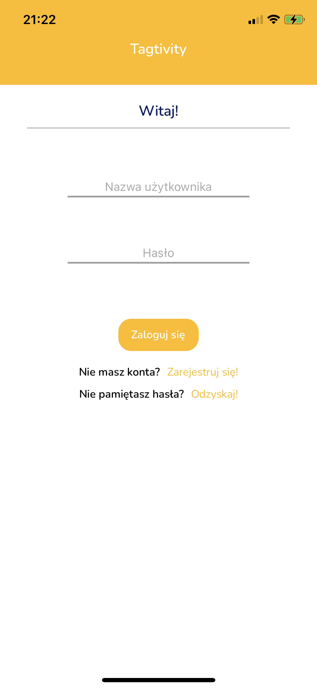
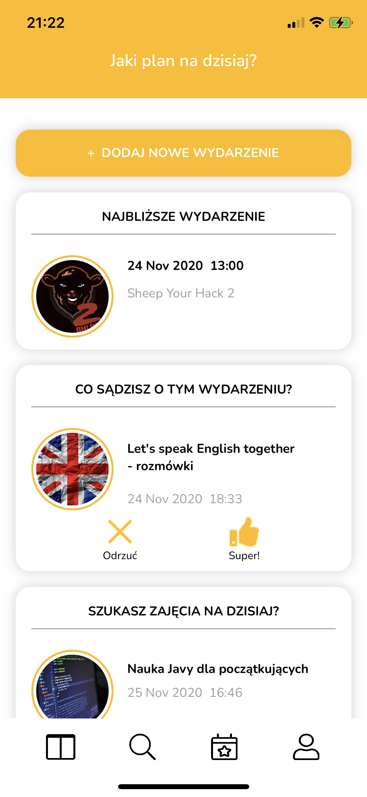
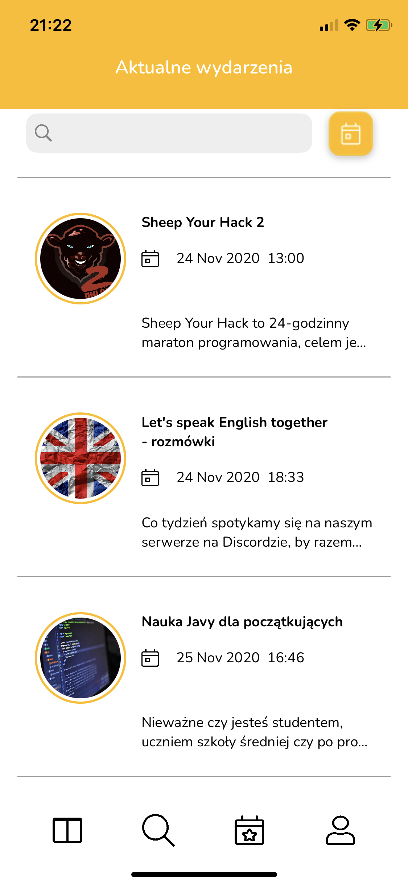
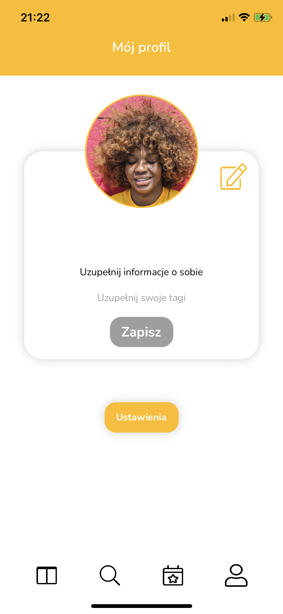
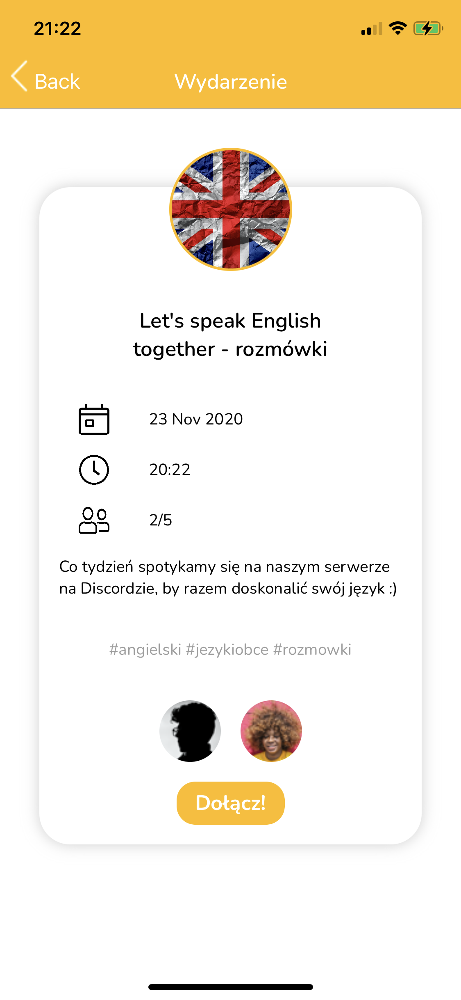
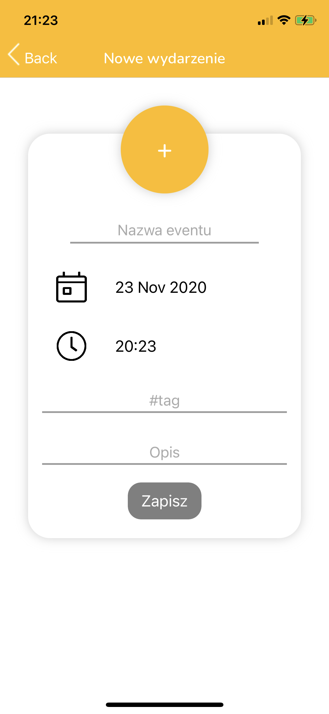
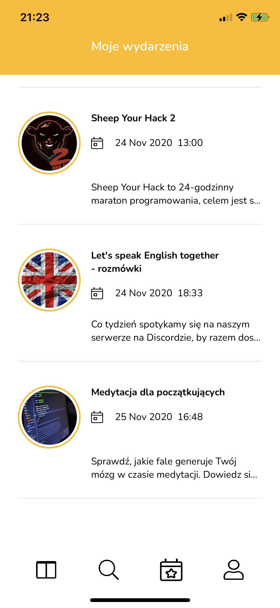

# tagtivity

## About
Tagtivity is an application to exchange knowledge with other users.

## Why?
Application was implemented on `hackahton - Sheep your hack 2`, and it got a distinction.
Total time for implementaiton was 24 hours.

## Data
Application was integrated with server (Spring framework) but for the purpuse of this repo a mock with basic data was written.

## Used library
- SwiftDate
- Tabman
- SnapKit
- SkyFloatingLabelTextField
- Moya

## Authors
- Szymon Gęsicki - iOS Application Developer
- [Jędrzej Głowaczewski](http://github.com/SpeeritX) - Graphic Designer
- Miłosz Głowaczewski - Backend Developer
- Danielle Saldanha - Project Manager & Thinker

## Screenshots
 

